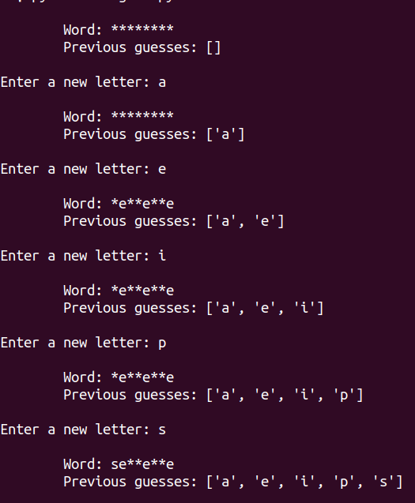
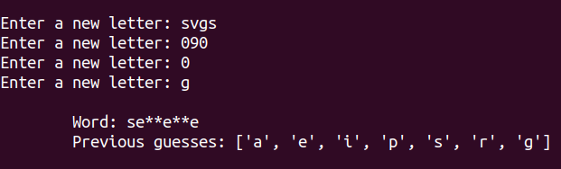
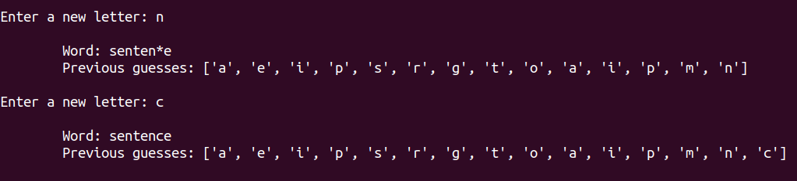

## Explanation

Hangman (in Italian, 'impiccato') is a game where the single-player has to guess a word by guessing the
letters it is made of.

The game should have the following features:
- Start by picking a random word to guess from a file. Some common English words are inside the file `words.txt` but you are
welcome to add your own.
- Allow the user to insert single characters. Note that inputs with more than one character should (probably) be ignored.
- After every guess, show the word but only with the characters that the user entered already.
- Finish once the word is fully guessed.

## Examples

Some screenshots from an example implementation.

Beginning of the game, with some guesses.

Invalid user input is ignored.

Game finishes when the word is fully guessed.

